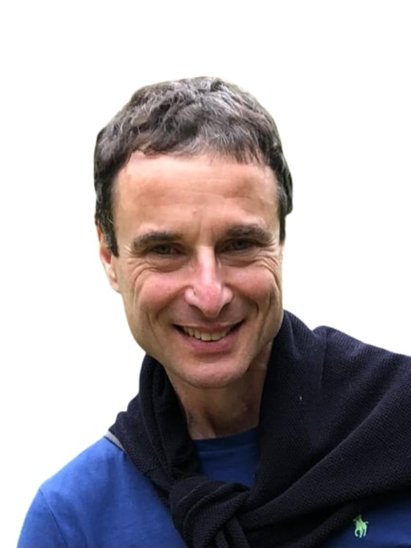

# Thanks for visiting 👋
## Here is a liitle bit of information about me.

## Introduction
My name is Cedric Littman and I live in Central London and travel a lot by bike.

I have experience in engineering, agriculture, food manufacture, sales and have also done voluntary work. I live in the UK and have lived in the US. My technical education consists of a BSc in electrical engineering which I took because I was very interested in radio. Since then I taught myself some programming and have assembled and modified several PC's. Most recently I have attended a Full Stack and a Python bootcamp.

## Acheivements
Probably my greatest achievement was in guiding a vertically integrated dairy business that produced cheese from its own milk through Thatcher's deregulation of the dairy industry which resulted in much processor consolidation, with now the four biggest processors being overseas owned, and a large reduction in milk producers resulting in much hardship among farmers. Whereas during this time the business I ran increased profitability and production and sales.

I have also done well in other fields such as technical sales and property management often by exploring the problems presenting themselves from a different angle and finding innovative solutions.

Now I have reawakened my passion for technology by participating in two bootcamps the fire that gets lit when I get a project working is burning fiercely again and I am looking for a way to keep it going.

## What Am I Doing Now?
Having just finished a Python Bootcamp I am continuing my studies and reinforcing what I learnt aand trying to maintain my Full Stack skills.

## How To Contact Me
The best way to collar me is by email at cedric@littman.me.uk. I look forward to hearing from you.

## Conclusion
I would like either to undertake a degree apprenticeship or get a job in software development.
<!--
**CedricLittman/CedricLittman** is a ✨ _special_ ✨ repository because its `README.md` (this file) appears on your GitHub profile.

Here are some ideas to get you started:

- 🔭 I’m currently working on ...
- 🌱 I’m currently learning ...
- 👯 I’m looking to collaborate on ...
- 🤔 I’m looking for help with ...
- 💬 Ask me about ...
- 📫 How to reach me: ...
- 😄 Pronouns: ...
- ⚡ Fun fact: ...
-->
